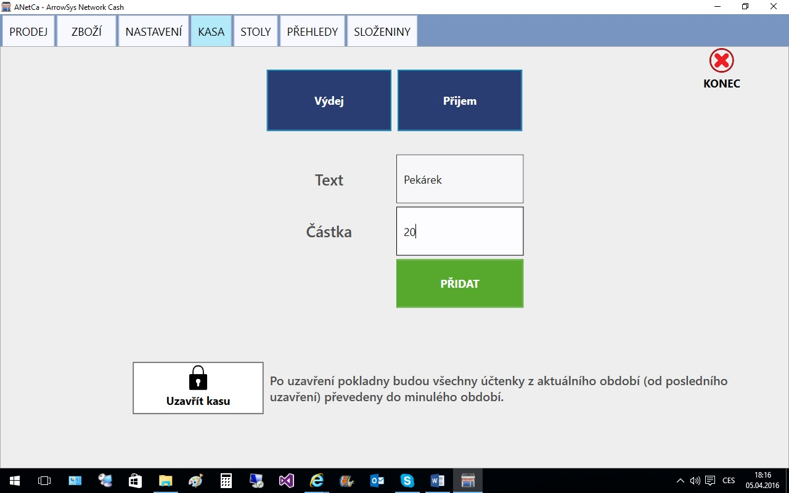

# Pokladna - KASA

Pokladna – KASA
1.	Stiskem na záložku KASA vyvoláme následující formulář. Stiskem tlačítka „Výdej“ se provede „Výdej“ uvedené částky, stiskem tlačítka „Příjem“ se provede příjem uvedené částky do pokladny.

2.	Tlačítko „Uzavřít kasu“ převede aktuální tržby do archivu a vytvoří nový počáteční stav pro nového prodávajícího k převzetí zůstatku pokladny.

