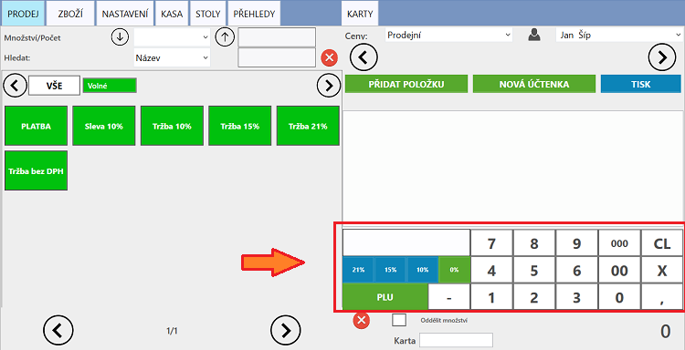

# Kalkulačka

Nachází se v levém dolním rohu hlavní účtovací obrazovky. Slouží k rychlému zadání tržby na účtenku.

Pro bezproblémový chod kalkulačky musí být založeny položky se správnou sazbou daně, cenou "1", kódem zboží "999999" a PLU:

* pro Bez DPH: 90900
* pro DPH 10%: 90910 
* pro DPH 15%: 90915
* pro DPH 21%: 90921

### Zadaní tržby na účtenku

1. Označte účtenku, na kterou chcete tržbu přičíst
2. Napište příslušnou částku tržby na kalkulačce
3. Stisknutím vybraného procenta DPH se tržba převede na označenou účtenku

Načíst lze také konkrétní položka, a to vyplněním jejího PLU a stisknutím tlačítka **PLU**. _\(kód PLU se nastavuje při vytvoření položky\)_

Pro zadávání stejné částky vícekrát je zde operátor **X** - násobení.

Tlačítko **CL** slouží k vymazání hodnoty na kalkulačce.

Lze zadat záporné hodnoty vyplněním příslušné hodnoty a následném stisknutí znaménka mínus **-**.

