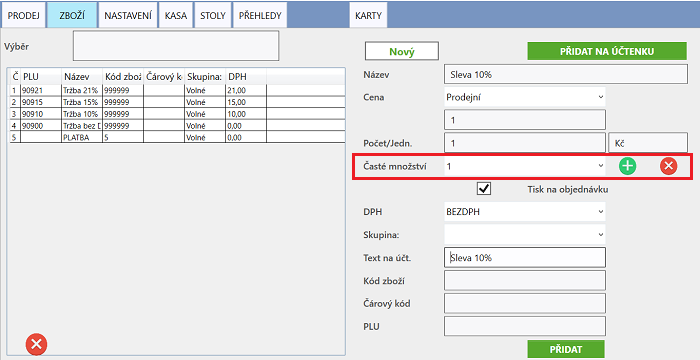

# Sleva

### Vytvoření slevy

1. V záložce **ZBOŽÍ** vyplňte vlastnosti slevové položky dle následujícího obrázku:

   
2. Rozbalte nabídku **Časté množství** (červeně orámovaná kolonka na obrázku) a vyberte "1". Následně stiskněte červený křížek,        který tuto hodnotu smaže.
3. Nyní do této kolonky napište znaménko mínus (*-*) a velikost slevy / 100. Např. pro 25% slevu bude hodnota -0,25. Potvrďte stiskem        zeleného tlačítka
4. Vytvořte položku stisknutím tlačítka **Přidat**

### Použití slevy

1. Na hlavní účtovací obrazovce **PRODEJ** klikněte na položku slevy
2. Do kolonky **Počet** (červeně orámovaná kolonka na obrázku) napište částku, ze které chcete zlevnit

   
3. Slevu přidejte na danou účtenku

   

