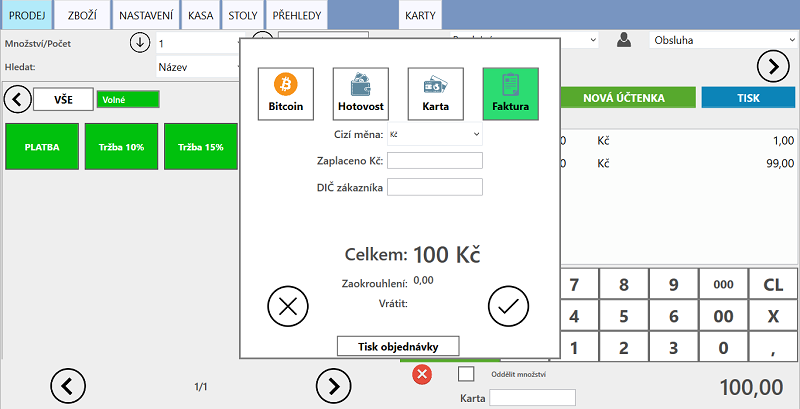
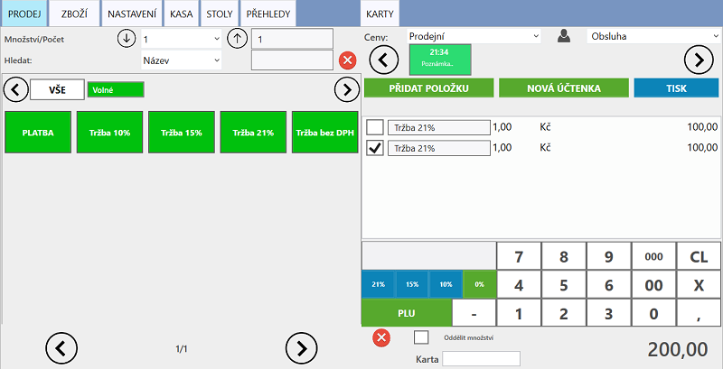
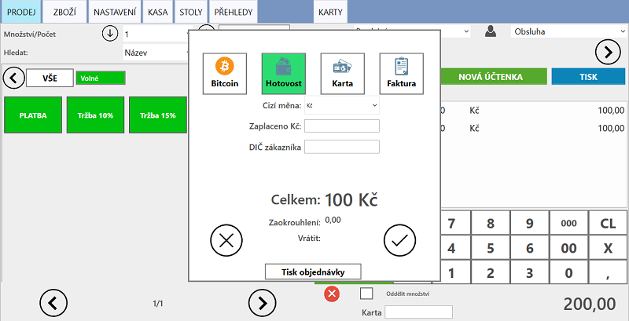

# Platba

### Hotovost

### Platba kartou

### Platba Bitcoinem
- Před použiváním vyplňte Bitcoin adresu či BIP44 veřejný klíč, nebo připojení BitcoinPay účet.

### Platba fakturou

Při úhradě účtenky fakturou, účtenka není odeslána do EET.

1. Po označení vybrané účtenky a stisknutí tlačítka **TISK** na hlavní účtovací obrazovce vyberte poslední možnost představující uhrazení účtenky fakturou
   
     
     
2. Po ukončení účtenky se vytiskne faktura

#### Přehled vystavených faktur

V záložce "PŘEHLEDY" mají všechny účtenky placené fakturou v závorce uvedeno *fakturou*.

## Částečná platba

1. Označte účtenku a vyberte (zaškrtněte) položky, které chcete uhradit
2. Pokračujte stisknutím tlačítka "TISK" a platbu dokončete

