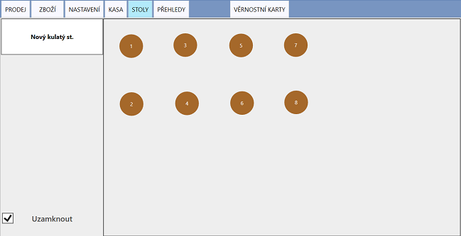
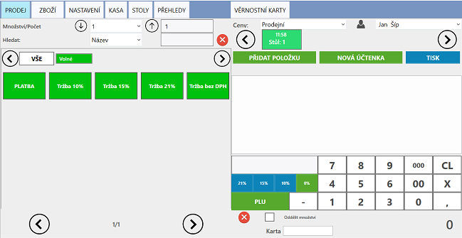
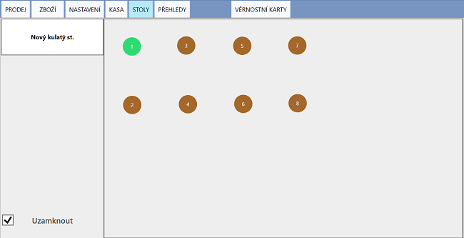

# Stoly

Stoly slouží k zpřehlednění účtenek pomocí grafického rozhraní.

Převážnou část záložky **STOLY** tvoří pracovní plocha, na kterou lze libovolně rozmístit libovolný počet stolů tak, aby simulovala prostředí vašeho podniku. 

### Rozmístění

Pro přidání nového stolu klikněte na tlačítko **Nový kulatý st.**. Pro pohybování se stoly po pracovní ploše je nutné nevolit mód **Uzamknout**.

### Účtenka ke stolu

1. Povolte mód **Uzamknout**
2. Klikněte na vybraný stůl

Nyní se zobrazí účtenka daného stolu na hlavní účtovací obrazovce **PRODEJ**.

Stoly, které již mají vytvořenou účtenku, jsou vybarveny zeleně - po zaplacení se barva opět změní na hnědou.

*obrázek: Po kliknutí na stůl č.1 se vytvoří účtenka pro první stůl*

*obrázek: Vytvořená účtenka na hlavní účtovací obrazovce*

*obrázek: Stůl s vytvořenou účtenkou je vybarven zeleně*

