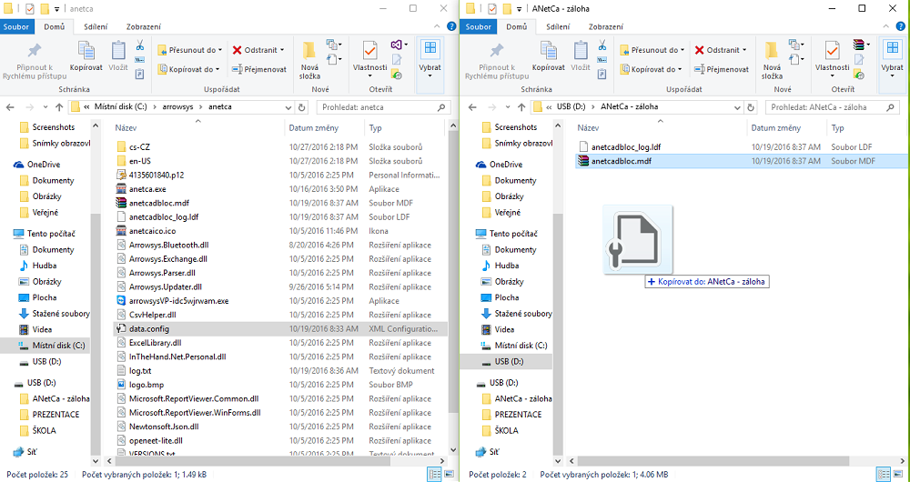

# Zálohování dat

Kompletní uživatelské nastavení a konfigurace obsahují tyto soubory:

- anetcadbloc.mdf

- anetcadbloc_log.ldf

- data.config

*Soubory jsou nejčastěji uloženy zde: C:\arrowsys\anetca*

### Záloha na externí zařízení

1. Připojíme externí jednotku do zařízení s produktem ANetCa (např. USB nebo externí disk).
2. Otevřeme složky s konfiguračními soubory (C:\arrowsys\anetca) a úložiště externí jednotky.
3. Kliknutím na konfigurační soubor a následným "přetažením" na úložiště externí jednotky se soubor překopíruje.

Pro kompletní zálohu dat je zapotřebí takto překopírovat **všechny tři konfigurační soubory**.

