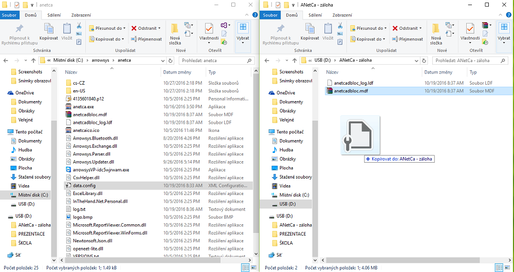

# Zálohování dat

## Automatická záloha dat

1. Připojte externí jednotku do zařízení s produktem ANetCa (např. USB nebo externí disk)
2. Spusťte program ANetCa a otevřete "NASTAVENÍ > Záloha"
3. Vyberte název připojené jednotky a potvrď stisknutím tlačítka "Záloha"

ANetCa se následně vypne a nahraje na vybrané externí zařízení zálohovaná data ve složce "anetca".

**Zálohují se všechny soubory uvedené na obrázku níže:**

   

## Manuální záloha dat

Kompletní uživatelské nastavení a konfigurace obsahují tyto soubory:

- anetcadbloc.mdf

- anetcadbloc_log.ldf

- data.config

*Soubory jsou nejčastěji uloženy zde: C:\arrowsys\anetca*

## Záloha na externí zařízení

1. Připojte externí jednotku do zařízení s produktem ANetCa (např. USB nebo externí disk)
2. Otevřete složky s konfiguračními soubory (C:\arrowsys\anetca) a úložiště externí jednotky.
3. Kliknutím na konfigurační soubor a následným "přetažením" na úložiště externí jednotky se soubor překopíruje.

Pro kompletní zálohu dat je zapotřebí takto překopírovat soubory: **anetcadbloc.mdf**, **anetcadbloc_log.ldf**, **data.config**.

