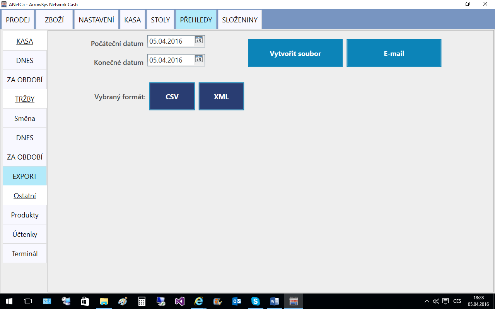

# Export dat

Program ANetCa umožňuje export dat do tvaru CSV nebo XML za období a tak vybraná data umístit na datový nosíč nebo odeslat e-mailem.  K tomu jsou firmou ArrowSys dodávány moduly Zásob a účetnictví, které bezpečně a neduplicitně provedou výdej a zaúčtování tak zaslaných výdejek.

