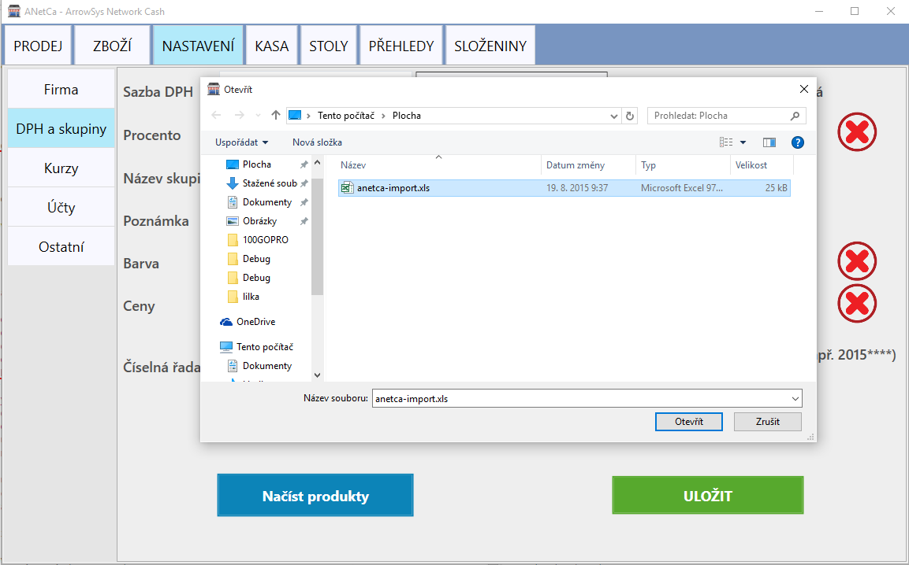

## Struktura sloupců souboru .XLS (Microsoft Excel 97-2003) pro nahrání produktů do ANetCa.

**.XLSX formát není podporovaný**

| Název | Zkratka | ID skupiny | DPH % | Cena | Množství | Jednotka | ČK | JKPOV | Prodej. množství | Kuchyně
| -- |
| text | text(50) | int | decimal(2) | decimal(2) | decimal(2)| text | text | text | decimal(4) | bit |
| Párek v rohlíku | Pár. v r. | 1 | 15,00 | 35 | 1 | Ks| 0123| 100021 | 1 | 1 |
| Párek | parek |  | 15,00 | 35 | 1 | Ks| | | | | |

* **Název** - název produktu
* **Zkratka** - text na účtenku, maximum je 50 znaku
* ID skupiny - vytvoří novou skupinu importovaných produktů. Pokud v ANetCa již zadané ID existuje, přiřadí se produkt k vybrané skupině.
* **DPH %** - sazba DPH. Pro přenesenou daň vyplňte příslušný kód např. P-04
* **Cena** - prodejní cena produktu, bude přiřazena k výchozí cenové kategorii v ANetCa
* Množství - Jednicové množství, výchozí 1
* **Jednotka**
* ČK - Čárový kód
* JKPOV - Číslo ceníku
* Prodej. množství - počet na účtenku, výchozí 1
* Kuchyně - 1 - položka patří do kuchyně

**Zvýrazněné sloupce musejí být naplněny, ostatní mohou být prázdné.**

DPH % - pro přenesenou daň vyplňte P0
JKPOV - Pokud již JKPOV existuje, cena se aktualizuje

Datové typy

decimal - číslo v závorce za *decimal* definuje desetinná místa, podporované formáty: 2; 2.00; 2,00

