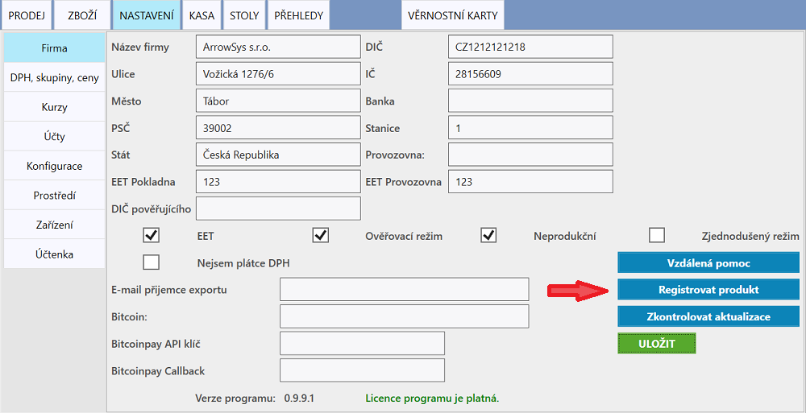

# Aktivování licence

Licence se aktivuje v **NASTAVENÍ** v záložce **Firma**. Kliknutím na tlačítko **REGISTROVAT PRODUKT** se otevře formulář, kam je potřeba vložit licenční kód, tel. číslo, email a IČO. Aktivace může probíhat pár vteřin.

