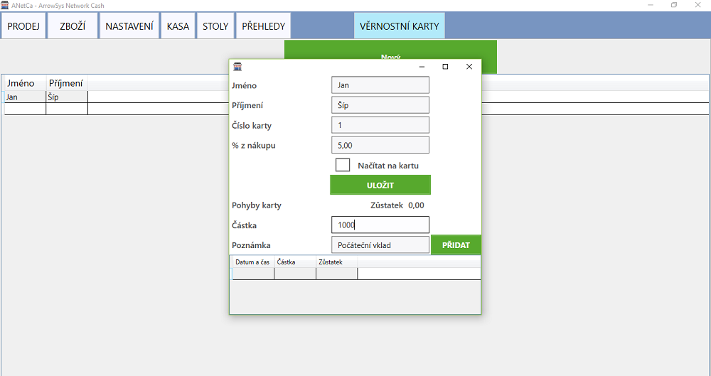
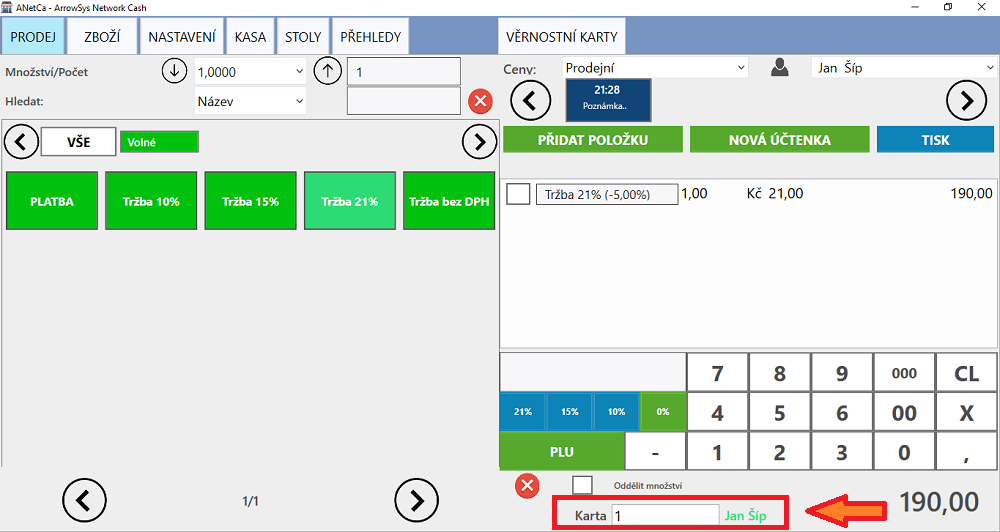

# Věrnostní karty

Věrnostní karty slouží k odměňování stálých zákazníků procentuální slevou.

### Vytvoření věrnostní karty

Stisknutím tlačíka **NOVÝ** se zobrazí formulář pro vytvoření karty. Po vyplnění zákazníkova jména a příjmení je potřeba vložit číslo, pod kterým bude karta identifikována na hlavní účtovací obrazovce (**PRODEJ**). V políčku **% z nákupu** se určuje, o kolik procent bude snížena celková částka nákupu. Odečtené procento se po zaplacení odečte od celkového zůstatku karty. Vložení zůstatku na kartu se provede vyplněním kolonky **Částka**, napsáním poznámky a stisknutím tlačítka **PŘIDAT**.

### Načtení karty

Karta se identifikuje v záložce **PRODEJ** zapsáním příslušného čísla karty do kolonky **Karta** (pod kalkulačkou na záložce **PRODEJ**). Pro úspěšné provedění slevy je zapotřebí **nejprve identifikovat kartu a až poté přidávat položky**.

