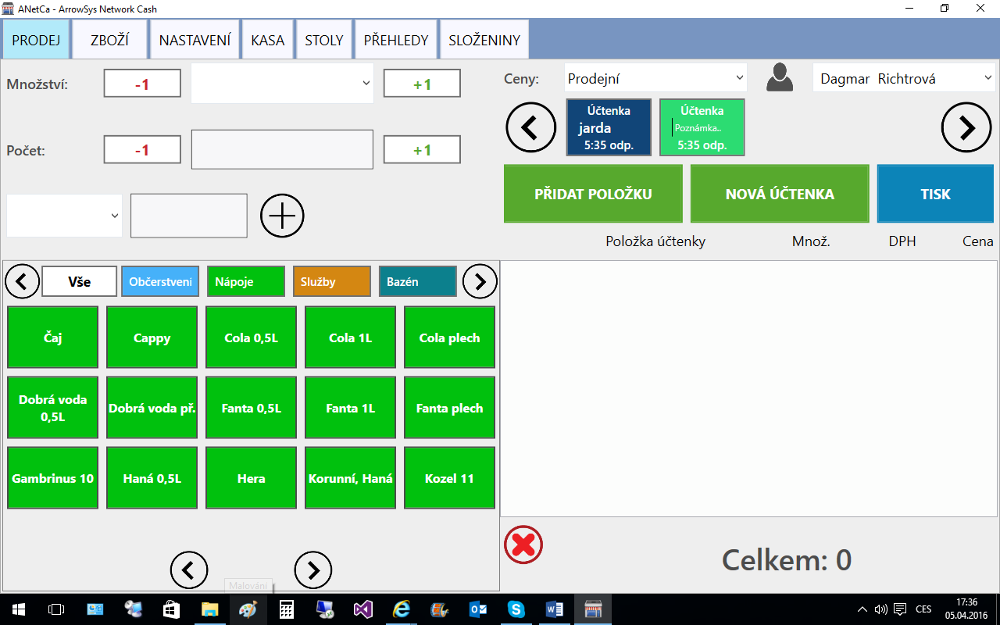
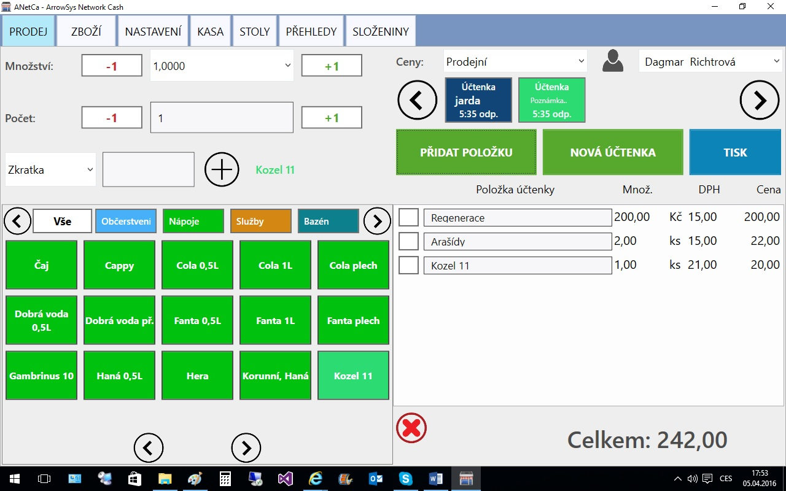
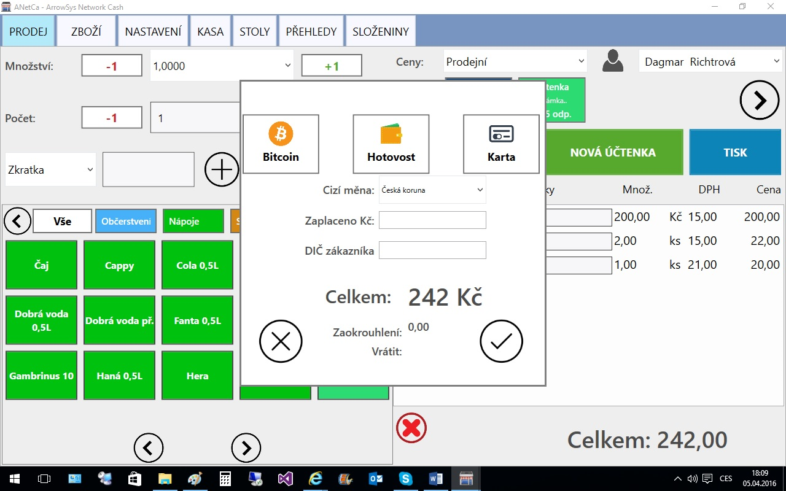

# Prodej

Níže uvedený obrázek ilustruje hlavní účtovací obrazovku systému ANetCa.

Obrazovka je členěna na základní 4 sekce –

Sekce 1 Založení účtenky (vpravo nahoře)
  1.	účtenku založíme tlačítkem  „NOVÁ ÚČTENKA“ 
  2.	účtenku zrušíme tlačítkem Červený křížek v kolečku – účtenka musí být prázná
  3.	z více účtenek vybereme danou kliknutím na tuto účtenku
  4.	text na účtence je možno přepsat (nap5. Stů 9, Paní v černém, jarda, atd.)
  5.	účtenkový pás je nekonečný – posouvá se stiskem šipky v kolečku vpravo nebo vlevo.

Sekce 2 Výběr zboží (vlevo dole)
  1.	po spuštění programu se zobrazí všechna tlačítka za všechny skupinu
  2.	pás skupin je nekonečný – posouvá se stiskem šipky v kolečku vpravo nebo vlevo.
  3.	stiskem na skupinu lze vybrat je danou skupinu (viz obrázek dále)  
  4.	stiskem na tlačítko položky položku vyberem a doplní se základní definované množství
  5.	pás ppoložek jenkonečný – posouvá se stiskem šipky v kolečku vpravo nebo vlevo pod tlačítky položek

  6.	zboží lze vybrat rovněž zkratkou nebo čtečkou čárového kódu
Sekce 3 Množství vybraného zboží (vlevo nahoře)

  1.	lze přepisovat nebo inkrementovat nahoru dolu tlačítka „+“ nebo „-“ hodnoty se pak pronásobí do výsledného množství

Sekce 4  Účtenka a tisk (vpravo dole)
  1.	tlačítko „PŘIDAT POLOŽKU“ přidá již dříve vybranou položku do účtenky i opakovaně
  2.	tlačítko „TISK“ účtenku vytiskne a pevně uloží
  3.	zaškneme-li čtverec před položku v účtence, lze ji pak stiskem červeného křížku v kolečku smazat
  4.	v řádkách účtenky je možno přepsat text (vhodné pro řemeslníky nebo detailnější označení zboží)  
  5.	vpravo dole je průběžný součet účtenky
  6.	po stisku tlačítka tisk se objeví dialogové okno (viz  dále)
  7.	zde je možno vybrat způsob platby v Kč, cizích měnách, bitcoinem, Bitcoinpay bránou nebo kartou v POS nebo mPOS terminálu a účtenku vytisknout buď na systémovou tiskárnu nebo bluetooth tiskárnu dle nastavení.

