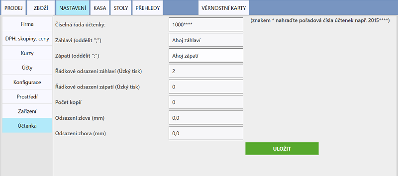
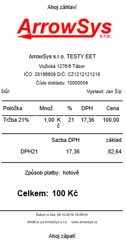

# Nastavení účtenky

Nastavení účtenky probíhá v **NASTAVENÍ > Účtenka**. Veškeré změny je potřeba vždy uložit kliknutím na tlačítko **ULOŽIT**.

### Číselná řada účtenky

Vyplňte kolonku pouze čísly a hvezdičkami. Například při zadání této číselné řady: 2016****** **bude první vytvořená účtenka nést číslo 20160001, druhá pak 20160002 a například stá účtenka se vytiskne pod číslem 20160100.

### Odsazení

Odsazení záhlaví odsazuje text účtenky od horní hranice účtenky tak, že vytvoří prázdnou řádku (vyplněné číslo udává počet řádků). Odsazení zápatí pak odsazuje od dolní hranice.

Odsazení zleva nebo zprava udává o kolik milimetrů bude text na účtence odsazen od levého/pravého okraje účtenky.

### Poznámka na účtence

Poznámku je možné vložit buď do záhlaví nebo zápatí účtenky.

*obrázek: Účtenka*

### Šířka účtenky

Šířku účtenky nastavíte v **NASTAVENÍ > Prostředí**. Zde vyberete 48 nebo 70 milimetrů.
