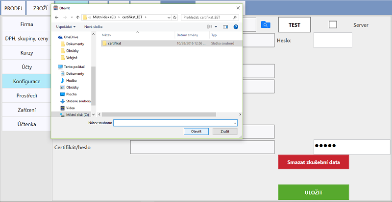
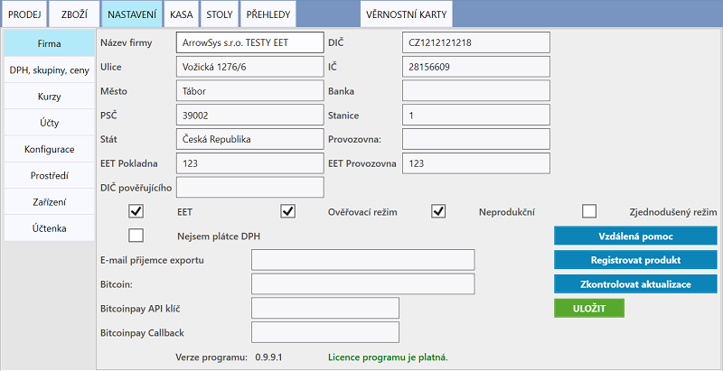

# Nastavení elektronické evidence tržeb

Před vyplněním údajů pro napojení na EET je zapotřebí získat Digitální certifikát. Návod naleznete na serveru [e-trzby.cz](http://www.etrzby.cz/cs/webova-aplikace-EET-a-certifikaty). Soubor certifikátu je zapotřebí vložit přímo do zařízení na kterém je pokladní systém spuštěn.

### Aktivace funkce odesílání do systému EET

1. Přesuneme se do **NASTAVENÍ > Konfigurace**, kde je potřeba vyplnit:
   
   - **Certifikát** - Do této kolonky je potřeba zadat cestu k certifikátu, pokud je cesta prázdná, po ťuknutí na kolonku se zobrazí výběr                       pro doplnění cesty. 
   - **Heslo** - Heslo, které bylo zadáno při vytvoření certifikátu na [Webové aplikaci EET](http://adisspr.mfcr.cz/adistc/adis/idpr_pub/eet/eet_sluzby.faces)
   - Nastavení uložíte kliknutím na tlačítko **Uložit**. 
   
   
   
2. Následně je zapotřebí v **NASTAVENÍ > Firma** vyplnit:

   - **DIČ** - musí obsahovat předponu CZ, například CZ1212121218
   - **EET Provozovna** (většinou 12 nebo 21) maximálně 999999
   - **EET Pokladna** (libovolné, může obsahovat max 20 alfanumerických znaků např. POKLADNA1)
   - V případě Komisního (Zástupného) prodeje je nutné vyplnit **Pověřující DIČ**.
   - Pokud má provozovna od Finančního úřadu schválenou možnost evidence ve zjednodušeném režimu, zvolte možnost **Zjednodušený režim**.
   - Po vyplnění požadovaných údajů aktivujte odesílání do EET zaškrtnutím **EET**. 
   - Pro kontrolu nastavení a správnosti odesílaných dat můžete zvolit možnost **Ověřovací režim**. Při pořízení účtenky v OR bude     
     provedena kontrola odesílaných údajů. Odesílaná účtenka nebude evidována, nýbdrž zkontrolována. Při správném nastavení by měl server 
     EET vrátit odpověď "*0 Datovou zpravu evidovane trzby v overovacim modu se podarilo zpracovat*"
   - Nastavení uložíte kliknutím na tlačítko **Uložit**. 

   
**Neprodukční prostředí**
- Do neprodukčního prostředí lze odesílat pouze s [Playground certifikáty](http://www.etrzby.cz/assets/cs/prilohy/EET_CA1_Playground_v1.zip). Podmínkou je mít vyplněné DIČ a zvolenou volbu **Neprodukční prostředí**