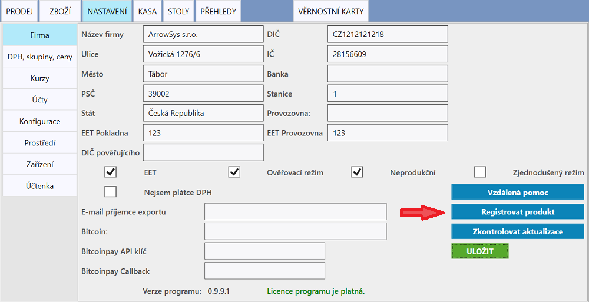

# Aktivování licence

Licence se aktivuje v **NASTAVENÍ** v záložce **Firma**. Kliknutím na tlačítko **Registrovat produkt** se otevře formulář, kam je potřeba vložit:

1. licenční kód (kód vám bude zaslán po zaplacení produktu ANetCa)
2. tel. číslo 
3. email
4. IČO

Aktivace může probíhat pár vteřin.

