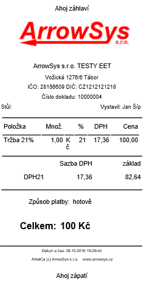

# Nastavení účtenky

Nastavení účtenky probíhá v **NASTAVENÍ &gt; Účtenka**. Veškeré změny je potřeba vždy uložit kliknutím na tlačítko **ULOŽIT**.

### Číselná řada účtenky

Vyplňte kolonku pouze čísly a hvezdičkami. Například při zadání této číselné řady: 2016_\*\*_ bude první vytvořená účtenka nést číslo 20160001, druhá pak 20160002 a například stá účtenka se vytiskne pod číslem 20160100.

\***POČET HVĚZDIČEK V ČÍSLOVÁNÍ ÚČTENKY URČUJE POČET PLOVOUCÍCH MÍST PRO ČÍSELNOU ŘADU, VE KTERÉ CHCETE POKRAČOVAT.**

### Odsazení

Odsazení záhlaví odsazuje text účtenky od horní hranice účtenky tak, že vytvoří prázdnou řádku \(vyplněné číslo udává počet řádků\). Odsazení zápatí pak odsazuje od dolní hranice.

Odsazení zleva udává o kolik milimetrů bude text na účtence odsazen od levého okraje účtenky.

### Poznámka na účtence

Poznámku je možné vložit buď do záhlaví nebo zápatí účtenky.

_obrázek: Účtenka_

### Šířka účtenky

Šířku účtenky nastavíte v **NASTAVENÍ &gt; Prostředí**. Zde vyberete 58 nebo 70 milimetrů.

