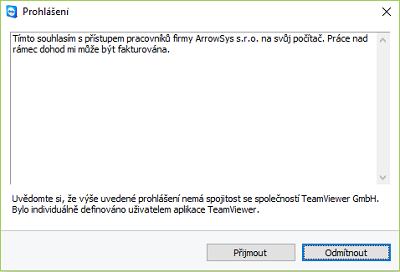
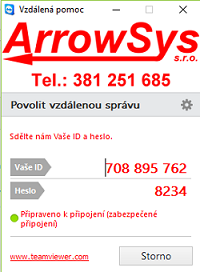

# Vzdálená pomoc

1. Otevřete **NASTAVENÍ > Firma** a klikněte na tlačítko **Vzdálená pomoc**
2. Po zobrazení okna o povolení změn aplikaci TeamViewer stiskněte tlačítko "povolit"
3. Následně se vykreslí prohlášení, kde jsou vypsány podmínky práce - pokračujte stisknutím tlačíka **Přijmout**

   

4. Nyní kontaktujte zákaznickou podporu Arrowsys na čísle **381 251 685** a sdělte váš problém, popřípadě ID a heslo vašeho TeamVieweru

   
