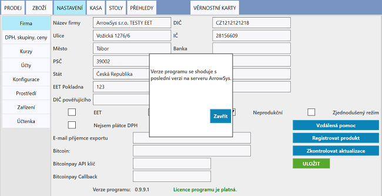

# Aktualizace

K úspěšnému aktualizování je zapotřebí mít připojení k internetu.

Produkt ANetCa lze aktualizovat v **NASTAVENÍ > Firma**. Zde je potřeba stisknout tlačítko **Zkontrolovat aktualizace**. Program nejprve ověří platnost licence a následně se začně aktualizovat. Aktualizace by měla trvat zhruba dvě minuty v závislosti na rychlosti vašeho internetového připojení.

*obrázek: V případě, že je program již aktualizován na nejnovější verzi se zobrazí tato hláška*
