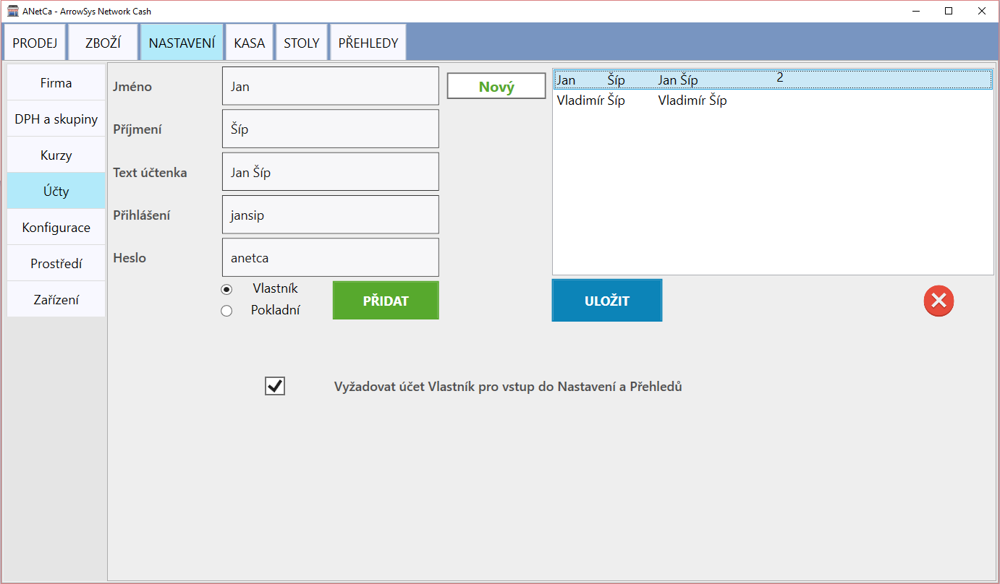

# Účty

Záložka účty slouží k nastavení osob osbsluhujících program ANetCa. Můžete vytvořit dva druhy účtů, **Vlastník** a **Pokladní**.

Pokud zaškrtnete volbu "Vyžadovat účet Vlastník pro vstup do Nastavení a Přehledů", budou karty Nastavení a Přehledy přístupné pouze pro ty účty, které jsou vytvořené s oprávněním Vlastníka. Tuto volbu je možné vybrat pod kolonkou Heslo. V případě, že vyplníte i kolonku heslo, bude heslo vyžadováno při přepnutí obsluhy v záložce "Prodej".

Pokud vytváříte účty poprvé nebo měníte oprávnění, je nutné program zavřít a spustit znovu. Poté již začnou fungovat nové účty, nebo provedené změny v nastavení jednotlivých účtů.