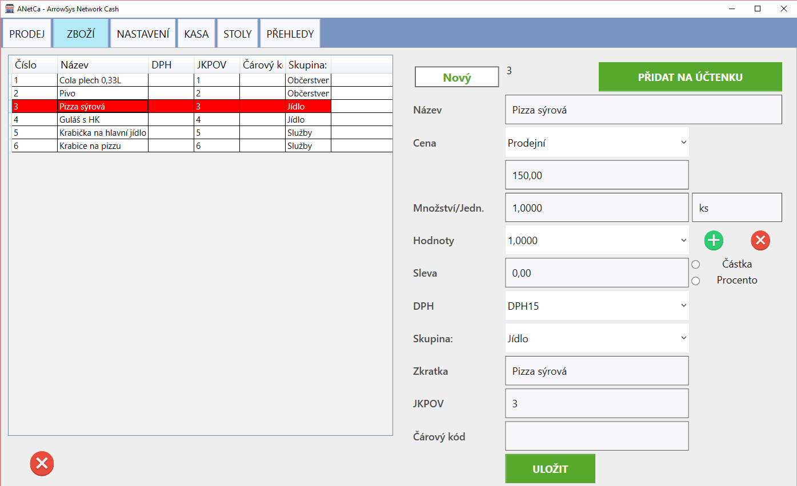

# Zboží

Záložka zboží slouží k zadání položek pro prodej. 

Zároveň v této sekci můžete vybráním zboží ze seznamu a stisknutím tlačíka "Přidat na účtenku" přidávat položky přímo na aktuální účtenku. Položka se na účtenku přidá ve výchozím stavu a není zde možné zadávat množství.

